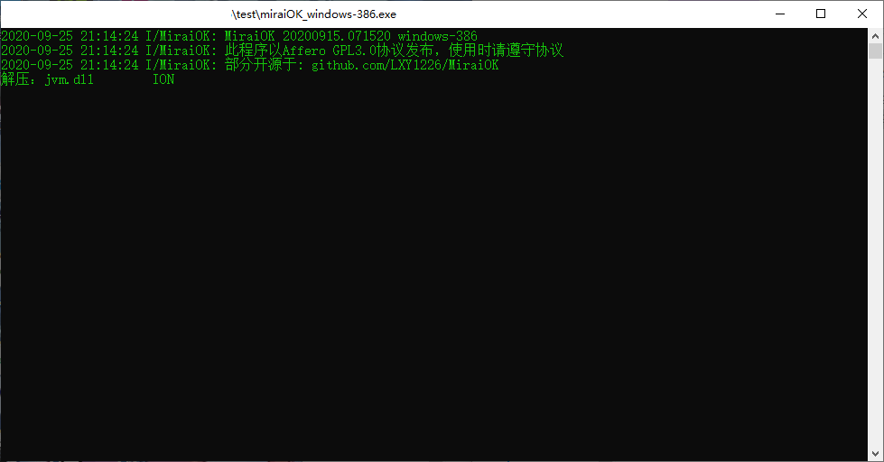
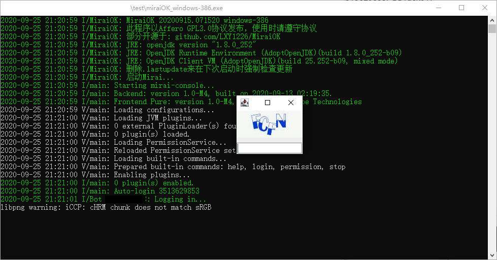
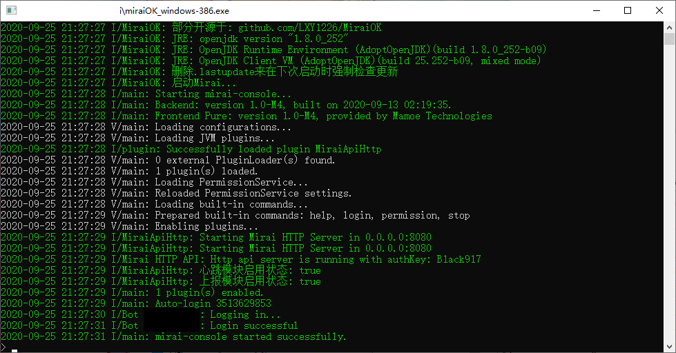
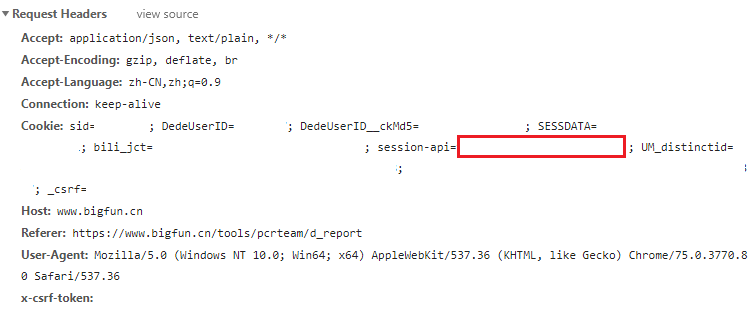
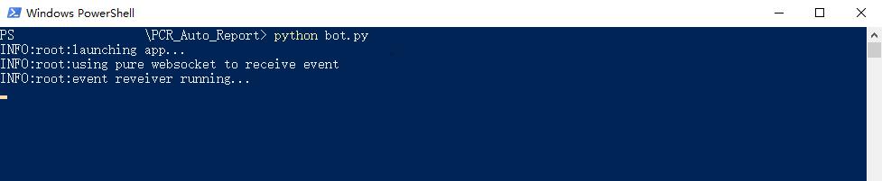

# PekoBot

​	一款全自动对接Bigfun公主连结板块公会战数据的QQ群用机器人，省去报刀的麻烦，Bigfun的数据会在10s以内同步到机器人的数据库中。

## 使用方式

> 1. 由于本Bot依赖于Mirai-Core、Mirai-Console、MiraiApiHttp，所以需要先部署Mirai并安装MiraiApiHttp插件，如果你已经部署好了，可以跳过以下的部署教程，直接转入第7步。如果你还没有部署过Mirai环境，请跟着以下教程一步步部署。
>
> 2. 将Resource文件夹中的miraiOK_windows-386.exe拷贝到你想要安装mirai的地方，最好找个空文件夹。
>
> 3. 双击运行miraiOK_windows-386.exe，出现以下界面
>
>    
>
>    等待直到命令行自动退出，然后再次运行。
>
> 4. 进入config/Console文件夹，用记事本打开AutoLogin.yml，将里面的plainPasswords下面的数字改成要运行机器人的qq号，example改为密码，即冒号前面为qq，冒号后面为密码，md5Passwords下面的不用管。
>
> 5. **用管理员权限**再次运行miraiOK_windows-386.exe，等待一会，出现一个验证码
>
>    
>
>    这是由于在新设备上登录所以需要输一次验证码，正常情况下输完就可以登录了，如果有开设备锁的话后面还会继续弹出一个窗口，跟着窗口指引用登录该账号了qq的扫一下码就行。
>
>    完成后关闭窗口再次**以管理员权限**运行miraiOK_windows-386.exe。
>
>    
>
>    如果一切正常，应该会出现这个界面，这时Mirai已经部署好了
>
> 6. 回到当时下载下来的机器人目录，将Resource中的mirai-api-http-v1.8.3.jar拷贝到mirai安装目录下的plugins文件夹中，重启MiraiOK来安装mirai-api-http插件，这一步完成以后所有需要部署的环境就已经配置好了。
>
> 7. 回到机器人文件夹，在当前目录运行powershell（如果你不知道怎么运行powershell，请百度），输入命令`pip install -r requirements.txt`然后回车，等待机器人需要的依赖安装完成。
>
> 8. 打开config.json，将qq后面的数字改成要运行机器人的qq号，authKey请到mirai安装目录的config/MiraiApiHttp文件夹里的setting.yml中找到对应的字符串复制并粘贴，group后面的数字改为机器人要监听的群号，最下面一行的cookies登录https://www.bigfun.cn/tools/pcrteam/d_report来获取，具体获得cookies的方法参照https://jingyan.baidu.com/article/0aa2237505193488cd0d647f.html，在network中拿到cookies以后，选择其中的ssession-api内容，如下：
>
>    
>
>    将你那里如图中红方框圈出的地方拷贝到config.json中的your cookies处。
>
> 9. 在powershell中输入`python bot.py`并回车
>
>    
>
>    如果看到了这个界面，那么恭喜你bot已经成功运行了。
>
> 10. 在群里发送“绑定 游戏昵称“，“查刀”，“总查刀”， ”状态”来测试机器人是否运行成功，如果成功，你应该看到机器人回复如下消息。
>
>     
>
>     
>
>     

## 指令表

**所有括号内的参数如果省略则默认查询已绑定的游戏角色**

| 指令                | 效果                                         |
| ------------------- | -------------------------------------------- |
| 绑定 游戏内名称     | 将群内id与游戏角色绑定                       |
| 查刀 (游戏内名称)   | 查询玩家今日出刀记录                         |
| 总查刀 (游戏内名称) | 查询玩家本期会战所有出刀记录，以图片形式展示 |
| 预约x               | 预约x号boss，当公会进度到该boss时会@该成员   |
| 查x                 | 查询已预约x号boss的成员                      |
| 状态                | 查询公会目前排名以及当前boss进度             |

## 注

由于是对接Bigfun来获得数据，所以更新速度取决于Bigfun的数据更新间隔，Bigfun数据更新后将在10s内同步到机器人。

## Special Thanks

[Graia]: https://github.com/GraiaProject
[Mirai]: https://github.com/project-mirai
[MiraiOK]: https://github.com/LXY1226/MiraiOK

